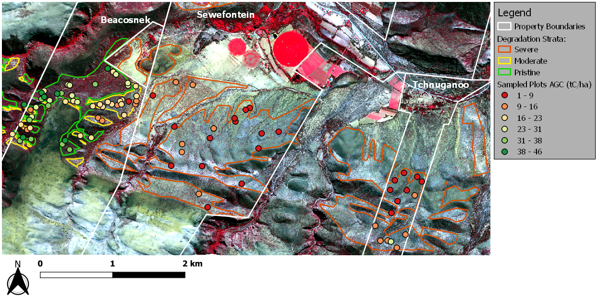
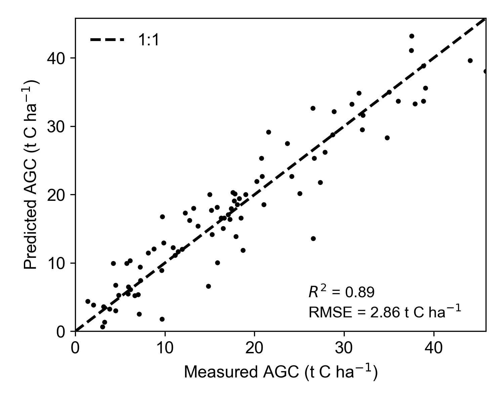
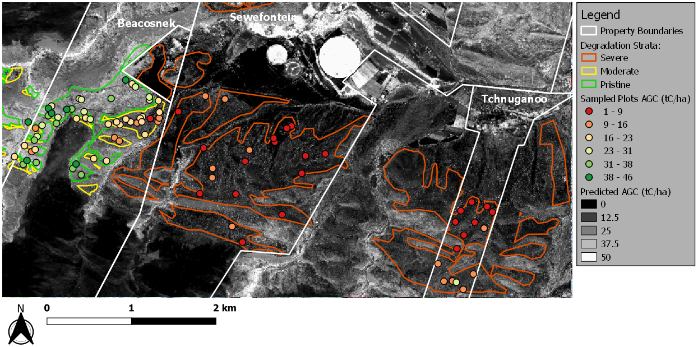

# Above ground carbon estimation in thicket using multi-spectral images
Aboveground carbon (AGC) maps are needed for monitoring of thicket restoration in  South Africa.  This project developed a method for mapping AGC using multi-spectral satellite imagery.  The work was undertaken as part of the [GEF5-SLM](https://www.thegef.org/project/securing-multiple-ecosystems-benefit-through-slm-productive-degraded-landscapes-south-africa) (sustainable land management project) project.  

Generic modules for allometry, image feature extraction, feature selection and applying models to large rasters may be useful for other projects.

More details can be found in the [report](docs/gef5_slm_final_report_new_c_methodology_dec2019.pdf).

## Getting Started
### Installation
Using the `conda` package manager, for resolving binary dependencies is the recommended way.  The [Minconda](https://docs.conda.io/en/latest/miniconda.html) installation includes a minimal `conda`.
1) Create a conda environment and install dependencies:
```shell
conda create -n <environment name> python=3.8 -c conda-forge 
conda activate <environment name> 
conda install -c conda-forge matplotlib numpy scipy scikit-learn openpyxl rasterio geopandas 
```
2) Clone the git repository and link into the conda environment:
```shell
git clone https://github.com/dugalh/map_thicket_agc.git
pip install -e map_thicket_agc
```        
3) Create the `data/inputs/imagery` directory and download the [satellite and aerial imagery](https://1drv.ms/u/s!Aq0bZ0KcAqFZgRawIwhndMUdXFEs?e=q9HaPC) into it

### Requirements  
The following dependencies are installed in the process above.  The `geopandas` and `rasterio` packages have binary dependencies that are not directly available through `pip`, hence the recommendation for using `conda`.  
  
  - python >= 3.6
  - geopandas >= 0.8
  - rasterio >= 1.1
  - numpy >= 1.19
  - scipy >= 1.5
  - scikit-learn >= 0.23
  - matplotlib >= 3.3
  - openpyxl >= 3.0

### Data
Allometric and plot location data for generating AGC ground truth are included in the repository.  Satellite and aerial imagery is too large for `git` and can be downloaded separately.

Path | Description
---|---
[data/inputs/allometry](data/inputs/allometry) | Woody and litter allometric measurements from 90 sampling plots in the Baviaanskloof, South Africa, and [allometric models](https://www.researchgate.net/publication/335531470_Aboveground_biomass_and_carbon_pool_estimates_of_Portulacaria_afra_spekboom-rich_subtropical_thicket_with_species-specific_allometric_models) for common thicket species.    
[data/inputs/plot_locations/corrected](data/inputs/plot_locations/corrected) | Polygons of sampling plot boundaries with differential correction to < 30cm accuracy.      
[data/inputs/plot_locations/uncorrected](data/inputs/plot_locations/uncorrected) | Reference and sampling plot corner points with no differential correction.      
data/inputs/imagery | Satellite and aerial imagery (see [Installation](#installation)). 

### Generating Results
The [scripts](scripts) directory contains python scripts for generating results.  To run the scripts in the required order, execute:
```shell
python map_thicket_agc/scripts/run_all.py
```

Script | Description
------ | -----------
[scripts/run_all.py](scripts/run_all.py) | Executes the scripts in sequence
[scripts/generate_agc_ground_truth.py](scripts/generate_agc_ground_truth.py) | Applies allometric models to plant and litter measurements to generate AGC for the 90 sampling plots 
[scripts/generate_agc_shapefile.py](scripts/generate_agc_ground_truth.py) | Combines the above ground truth with plot locations to generate a shapefile of plot polygons with fields for AGC etc 
[scripts/fit_agc_model.py](scripts/fit_agc_model.py) | Extracts features from the satellite image, selects a set of informative features, and fits and evaluates models for predicting AGC from these features  
[scripts/generate_agc_map.py](scripts/generate_agc_map.py) | Applies fitted model(s) to the satellite image to generate a coarse resolution AGC map
[scripts/evaluate_calibration.py](scripts/evaluate_calibration.py) | Evaluates a method for calibrating AGC models to new images (using an additional two satellite images and a mosaic of aerial imagery)

## Summary of Results
See the [full report](docs/gef5_slm_final_report_new_c_methodology_dec2019.pdf) for more detail.

### Ground Truth 
Ground truth AGC data were generated by applying [existing allometric models](https://www.researchgate.net/publication/335531470_Aboveground_biomass_and_carbon_pool_estimates_of_Portulacaria_afra_spekboom-rich_subtropical_thicket_with_species-specific_allometric_models) to plant measurements gathered in the Baviaanskloof, South Africa.  90 sampling plots were spread over three degradation strata (WorldView-3 Aug 2017 image in colour-infrared rendering).  



Satellite image courtesy of the [DigitalGlobe Foundation](http://www.maxar.com)

### Modelling
Regression models were fitted to an informative subsets of image features.



### Mapping
Application of the AGC model to the WorldView-3 image.



### Temporal Calibration
A method for calibrating AGC models to new images gave encouraging results.  Tests were conducted on the original WorldView-3 image ("WV3 Aug 2017"), two additional WorldView-3 images("WV3 Oct 2017" and "WV3 Nov 2018"), and a mosaic of aerial imagery ("NGI April 2015").  The table shows *R*<sup>2</sup> between actual and predicted AGC for calibrated models.  Calibration images are along the columns and model fit images down the rows.

*R*<sup>2</sup> | WV3 Oct 2017 | WV3 Nov 2018 | WV3 Aug 2017 | NGI April 2015
---|--------------|--------------|--------------|---------------
**WV3 Oct 2017** | - | 0.8309 | 0.7994 | 0.7241
**WV3 Nov 2018** | 0.8413 | - | 0.7915 | 0.7195
**WV3 Aug 2017** | 0.8392 | 0.8215 | - | 0.7027
**NGI April 2015** | 0.8099 | 0.7951 | 0.7443 | -

## Author
* **Dugal Harris** - *Method design and development* - [dugalh@gmail.com](mailto:dugalh@gmail.com)

## Credits
* **Cosman Bolus** - *Field work and allometry* - [cosbolus@gmail.com](mailto:cosbolus@gmail.com)
* **James Reeler** - *Policy advice and oversight* - [jreeler@wwf.org.za](mailto:jreeler@wwf.org.za)
* **Marius van der Vyver** - *Allometric models* - [mariusvdv@gmail.com](mailto:mariusvdv@gmail.com)
* **Rebecca Powell** - *GEF-5 SLM project coordination, E. Cape* - [rebeccajoub@gmail.com](mailto:rebeccajoub@gmail.com)
* **Center for Geographical Analysis** - *Assistance with imagery and DGPS device* - [www.sun.ac.za/cga](http://www0.sun.ac.za/cga/)
* **National Geo-spatial Information** - *Aerial imagery* - [www.ngi.gov.za](http://www.ngi.gov.za)
* Satellite images courtesy of the [DigitalGlobe Foundation](http://www.maxar.com)


## Citation
When using this code, please cite: 
- Harris, D., Bolus, C., Reeler, J. 2019. *Development of a method for remote sensing of aboveground carbon in subtropical thicket*, GEF-5 SLM, Rhodes University. Internal report.
